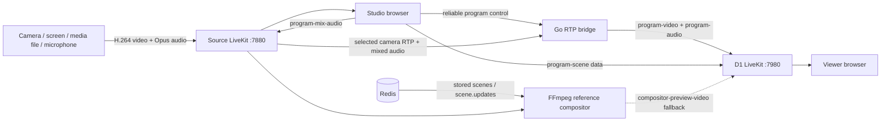

# LocalStream

Browser-based, low-latency multi-source broadcasting on a local network. Cameras, microphones, the production studio, and viewers connect through two isolated LiveKit SFUs. A Go RTP bridge forwards only the selected H.264 camera to the audience room without transcoding; the Studio mixes audio with the Web Audio API and distributes scene metadata over a reliable LiveKit data channel.

ภาษาไทย: [README.th.md](README.th.md)

> Development/learning configuration only. The repository contains fixed local API keys and Caddy's local CA workflow. Rotate credentials, add authentication/authorization, restrict CORS, and use trusted TLS before exposing it publicly.

## Current architecture



The active viewer path prefers `program-video` from the passthrough bridge. It renders image layers locally from the latest `program-scene` message. `compositor-preview-video` is an experimental fallback. The backend Scene API and Redis Pub/Sub support the reference compositor, but the current Studio UI does not PUT every local scene edit to that API.

## Services and ports

| Service | Host port(s) | Purpose |
|---|---:|---|
| Frontend | `3001` | Next.js UI and same-origin BFF routes |
| Control API | `8080` | Tokens, rooms, bridge, scenes, assets |
| Source LiveKit | `7880`, `7881/tcp`, `7882/udp` | Private production room |
| D1 LiveKit | `7980`, `7981/tcp`, `7982/udp` | Audience/program room |
| Compositor | `8090` | Worker health, readiness, metrics |
| Caddy | `3443`, `7443`, `7444`, `8081` | LAN HTTPS/WSS and local CA certificate |
| Redis / Redis D1 | internal | Scene state and independent LiveKit state |

Docker Compose starts eight services: two Redis servers, two LiveKit servers, backend, frontend, compositor, and Caddy. The LiveKit/Redis pairs are isolated from each other.

## Quick start

Requirements: Docker Desktop and a POSIX shell. Automatic LAN IP discovery uses macOS `ipconfig`; on other platforms set `LIVEKIT_NODE_IP` explicitly.

```bash
make infra-up
```

Or:

```bash
LIVEKIT_NODE_IP=192.168.1.10 make infra-up
```

Local URLs:

- Dashboard: `http://localhost:3001/channels`
- Camera: `http://localhost:3001/camera`
- Microphone: `http://localhost:3001/microphone`
- Studio: `http://localhost:3001/studio`
- Viewer: `http://localhost:3001/watch`
- LAN application: `https://<LAN_IP>:3443`

For phones, install `http://<LAN_IP>:8081/root.crt`, trust the local CA, then open `https://<LAN_IP>:3443/camera`. Signaling is proxied at `wss://<LAN_IP>:7443` (source) and `:7444` (D1); media still uses the advertised LiveKit TCP/UDP ports.

Stop the stack:

```bash
make infra-down
```

### Test the real D1 (Ant Media) without replacing the existing D1

Open `https://<LAN_IP>:3443/d1-test` (or `http://localhost:3001/d1-test`) and start the connection test. This isolated page publishes the browser camera and microphone directly to Ant Media, defaulting to `wss://rtc2.streamssl.com:5443/WebRTCAppEE/websocket` and stream ID `sell-image`.

The existing LiveKit D1, Studio, Viewer, and RTP bridge paths are unchanged. If publish security is enabled, enter its publish token on the test page. Docker defaults can be overridden with `ANT_MEDIA_WEBSOCKET_URL` and `ANT_MEDIA_STREAM_ID` before starting Compose.

The test page shows two monitors. **LOCAL / outbound** is the camera before publishing, while **D1 RETURN / inbound** is fed by a separate Ant Media player connection. Seeing `D1 ACCEPTED`, `RETURN RECEIVED`, and matching motion in the Return monitor verifies both directions. Secured deployments may require separate publish and play tokens.

The on-page Connection Console records Publish, Return, and Audio events and mirrors them to the browser developer console with a `[D1 ...]` prefix. Once publishing is active, enable Return audio and use **Send Test Sound to D1** to inject a 650 ms, 880 Hz tone into the actual outgoing audio track. Headphones are recommended to avoid an acoustic feedback loop.

## Broadcast workflow

1. Create a room at `/channels`. The in-memory Control API returns a six-character code and a room ID such as `room-ab12cd`.
2. Open `/camera` or `/microphone`, enter the code, and grant media permission.
3. Enter the generated Studio link. Studio joins the source room, ensures the bridge exists, then joins `<room>-program` on D1 as a monitor.
4. Add/select a camera in a Scene, choose audio inputs and gain, then press Start Broadcast.
5. Share `/watch?channel=<room-id>`. Do not use the six-character code as the `channel` value.

Before entering Studio, `Program Destination` can be set to either the existing LiveKit D1 path or a real/custom Ant Media destination. Ant Media mode still receives all cameras and microphones from the Source LiveKit room, publishes the selected Program camera plus Studio audio mix to the configured WebSocket URL and stream key, replaces the outgoing video track on Cut without reconnecting, and plays the Ant Media return feed in the Program monitor. It does not connect the local LiveKit D1 or start the RTP bridge. Scene image overlays are not currently burned into the Ant Media video.

Camera sources publish one stable, non-simulcast H.264 1080p/30 track (`camera-video`, up to 6 Mbps) and optional `camera-audio`. Screen, video-file, and image-file sources use the same publication boundary. Microphone-only pages publish `microphone-audio`.

On Start, Studio publishes `program-mix-audio`, sends `program-start` to bridge and compositor, and broadcasts a reliable `program-scene` snapshot on D1. During a cut, the bridge requests an IDR keyframe, waits for it, then rewrites RTP sequence numbers and timestamps to preserve continuity.

## Scene behavior

- Output contract: exactly 1920×1080 at 60 fps.
- Studio scene collections are stored per room in `localStorage` under `localstream-studio-scenes:<room>`.
- Uploaded PNG/JPEG/WebP/GIF assets are content-addressed and persisted in the `asset-data` Docker volume; maximum size is 5 MiB.
- The REST Scene API stores a single revisioned scene per room in Redis and publishes `scene.updates`. It rejects stale revisions with HTTP 409.
- The current Studio loads the server scene on entry, but edits remain in the local scene collection and are sent to viewers over D1 DataChannel when Program changes.
- A newly connected viewer receives the current snapshot only while Studio is connected and notices the participant join.

## Development and verification

```bash
make test                 # Go tests, frontend lint, production build
make backend              # Go Control API on :8080
make frontend             # Next.js dev server (default Next port)
./load-test.sh --help     # token API + LiveKit subscriber load test
```

The standalone backend defaults to an in-memory scene repository when `REDIS_URL` is unset, but its default asset directory is `/data/assets`; override `ASSET_DIR` if needed. Running the full frontend media workflow also requires both LiveKit instances.

## Important limitations

- Rooms exist only in backend process memory and disappear on restart. Multiple backend replicas do not share the room directory.
- There is no user login or room-level authorization. Anyone who can reach the token endpoint can request an allowed role.
- Bridge sessions live in one backend process, have no cleanup/recovery API, and are not distributed across replicas.
- Program video assumes H.264. The bridge's keyframe detector is H.264-specific.
- Audio mixing runs in the Studio browser; closing it stops the mix publisher and prevents scene snapshots for new viewers.
- Viewer count is only the `viewer-` identities currently visible in the D1 room.
- The FFmpeg compositor is a CPU reference implementation (`libx264`) and the active UI intentionally prefers passthrough video.
- CORS allows configured origins and, by default, private/loopback HTTP(S) origins only on ports 3000/3001. This is not production security.

## Documentation

- [Detailed application and media flow](flow.md) (Thai)
- [WebRTC concepts mapped to this codebase](webrtc_concepts.md) (Thai)
- [Control API and BFF specification](api_spec.md)
- [ข้อมูล API ภาษาไทย](api_spec.th.md)

## Repository map

```text
backend/cmd/api/          Control API, room store, RTP bridge, scenes, assets
backend/cmd/compositor/   Redis consumer and FFmpeg reference compositor
frontend/src/app/         Next.js pages and BFF route handlers
frontend/src/lib/         API client, channel naming, scene types
infrastructure/           Docker Compose, LiveKit, and Caddy configuration
scripts/start-local.sh    LAN IP discovery and stack startup
load-test.sh              Token/API and LiveKit subscriber load testing
```
