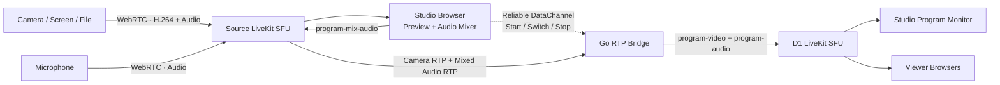

<div align="right">

**English | [ไทย](README.th.md)**

</div>

# LocalStream

A WebRTC live-production studio that accepts multiple camera sources, selects one Program feed, mixes audio from multiple inputs, and distributes the final output to viewers in real time.

Current highlights:

- Use a phone, computer, webcam, screen share, or media file as a source.
- Switch cameras in the Go RTP Bridge without re-encoding video.
- Mix sources and adjust their volume in the Studio.
- Keep the private Source Room separate from the viewer-facing Program Room.
- Send each viewer only one `program-video` track and one `program-audio` track.
- Test cameras and microphones from other devices on the LAN through HTTPS/WSS.

> This is currently a local-development setup. Do not use the checked-in API keys, secrets, or local CA in production.

## Architecture



The system is divided into two sides:

1. **Source side** — receives all raw cameras and microphones for the Studio and Go Bridge.
2. **Program side (D1)** — receives only the selected video and mixed audio for viewers.

Viewers never join the Source Room and cannot see `camera-video`, `camera-audio`, or `microphone-audio` tracks.

## Docker services

`make infra-up` starts seven services:

| Service | Responsibility |
| --- | --- |
| `frontend` | Next.js UI and BFF proxy for `/api/token`, `/api/rooms`, and `/api/bridge` |
| `backend` | Go Control API, JWT creation, room management, and RTP Bridge |
| `livekit` | Source SFU that receives every raw source |
| `redis` | State backend for Source LiveKit |
| `d1` | Program SFU that distributes Program Output to the Studio monitor and viewers |
| `redis-d1` | State backend for D1 LiveKit |
| `caddy` | HTTPS for the application and WSS reverse proxy for LiveKit signaling |

The Go RTP Bridge is not a separate container. It runs inside the `backend` container and creates a session when the Studio calls `/api/bridge`.

## Media flow

### Camera source

The `/camera` page:

1. Validates a Room Code through the Go API.
2. Requests a JWT for the Source Room.
3. Requests camera and microphone permission from the browser.
4. Encodes and publishes H.264 `camera-video` with `camera-audio`.
5. Sends the media to Source LiveKit over WebRTC.

The default mobile camera is the **rear camera**. A user can select the front or rear camera before connecting, or press **Switch Camera** while live without changing the source identity or publication.

### Microphone source

The `/microphone` page publishes only `microphone-audio`, with echo cancellation, noise suppression, and automatic gain control enabled.

### Studio

The `/studio` page:

- Subscribes to camera and audio tracks from the Source Room for preview.
- Selects the camera used as Program.
- Requests LOW quality for non-Program cameras and HIGH quality for the Program camera.
- Mixes audio with the Web Audio API.
- Publishes the mix back to the Source Room as `program-mix-audio`.
- Sends `program-start`, `program-switch`, and `program-stop` to the Bridge through a reliable DataChannel.
- Subscribes to the D1 Program Room to monitor the same result viewers receive.

### Go RTP Bridge

The Bridge subscribes to `camera-video` and `program-mix-audio` from Source LiveKit, then:

- Selects the camera specified by the Studio.
- sends RTCP PLI to request an H.264 IDR keyframe when starting or switching;
- waits for the keyframe before releasing the new video;
- rewrites RTP sequence numbers and timestamps to keep the Program track continuous;
- publishes `program-video` and `program-audio` to D1; and
- forwards downstream keyframe requests to the active camera.

Video uses RTP passthrough, so there is no Canvas capture or second video encode. Audio is mixed and re-encoded in the Studio browser.

### Viewer

The `/watch` page joins only the D1 Program Room with a subscribe-only token and subscribes to:

- `program-video`
- `program-audio`

Adding more sources does not increase the number of tracks received by each viewer. D1 load instead grows with the number of viewers.

## Requirements

To run the full stack with Docker:

- Docker Desktop or Docker Engine with Docker Compose
- `make`
- macOS for the current automatic LAN IP detection script

To run source code outside Docker:

- Node.js 20+
- Go 1.26+

Camera and microphone devices need a browser that supports WebRTC and `getUserMedia()`.

## Quick start

From the repository root:

```bash
make infra-up
```

This command:

1. Detects the LAN IP from `en0` or `en1`.
2. Builds the Frontend and Backend images.
3. Starts every Docker service.
4. Configures LiveKit to advertise the LAN IP.
5. Prints URLs for other devices.

Check the stack:

```bash
docker compose -f infrastructure/docker-compose.yml ps
```

Open these URLs on the server itself:

```text
Channels:   http://localhost:3001/channels
Camera:     http://localhost:3001/camera
Microphone: http://localhost:3001/microphone
Studio:     http://localhost:3001/studio
Viewer:     http://localhost:3001/watch
API health: http://localhost:8080/health
```

Stop the stack:

```bash
make infra-down
```

This does not delete Docker volumes. To remove Redis data and generate a new local CA, use `down -v` with care.

## Usage

1. Open `/channels` and create a Broadcast Room.
2. Copy its six-character Room Code.
3. Open `/camera` or `/microphone` on a source device.
4. Enter the Room Code and grant camera/microphone permission.
5. Open the Studio for that room.
6. Select the Program camera and audio sources to mix.
7. Start the broadcast.
8. Open `/watch?channel=ROOM_ID` to watch it.

Room records are held only in Go process memory. Restarting `backend` removes the room list and invalidates existing Room Codes.

## Phones and other devices on the LAN

Browsers do not allow a page served from a plain HTTP LAN address to access cameras or microphones. The stack therefore uses Caddy to issue a local certificate and serve HTTPS.

### 1. Join the same network

The server and test device should be on the same Wi-Fi/LAN. Avoid guest networks that enable client isolation.

### 2. Start the stack and find the LAN IP

```bash
make infra-up
```

Example output:

```text
LiveKit is advertising 192.168.1.10 to WebRTC clients
LAN application: https://192.168.1.10:3443
Install the LAN CA certificate first: http://192.168.1.10:8081/root.crt
```

If the script detects the wrong address, specify it explicitly:

```bash
LIVEKIT_NODE_IP=192.168.1.10 make infra-up
```

### 3. Install the Caddy local CA

Open the following URL on each test device:

```text
http://LAN_IP:8081/root.crt
```

#### iPhone / iPad

1. Open the URL in Safari and download the profile.
2. Open **Settings > General > VPN & Device Management** and install it.
3. Open **Settings > General > About > Certificate Trust Settings**.
4. Enable Full Trust for Caddy Local Authority.

#### Android

Install it as a CA certificate from Security or Encryption & credentials. The exact menu name varies by manufacturer and Android version.

#### Another Mac

Add the certificate in Keychain Access and set it to Always Trust.

The CA private key stays in the `caddy-data` Docker volume and is never available from the download endpoint. Never copy or distribute the private key.

### 4. Open the HTTPS application

Replace `LAN_IP` with the address printed by the startup script:

```text
Channels:   https://LAN_IP:3443/channels
Camera:     https://LAN_IP:3443/camera
Microphone: https://LAN_IP:3443/microphone
Studio:     https://LAN_IP:3443/studio
Viewer:     https://LAN_IP:3443/watch
```

The Camera page selects the rear camera by default and has controls for switching between the front and rear cameras.

### 5. Firewall

Allow these inbound ports on the server:

| Port | Protocol | Responsibility |
| --- | --- | --- |
| `3443` | TCP | Caddy HTTPS application |
| `7443` | TCP | Source LiveKit WSS signaling |
| `7444` | TCP | D1 LiveKit WSS signaling |
| `8081` | TCP | Public CA certificate download |
| `7881` | TCP | Source WebRTC media fallback |
| `7882` | UDP | Source WebRTC media |
| `7981` | TCP | D1 WebRTC media fallback |
| `7982` | UDP | D1 WebRTC media |

Caddy proxies only HTTPS/WSS signaling. RTP/SRTP media travels directly between devices and LiveKit over UDP/TCP.

## Ports

| Port | Service | Exposure |
| --- | --- | --- |
| `3001/TCP` | Next.js frontend | Direct localhost/LAN HTTP for viewers or debugging |
| `8080/TCP` | Go Control API | Direct API/debugging |
| `7880/TCP` | Source LiveKit signaling | Direct WS/debugging |
| `7881/TCP` | Source WebRTC TCP | Media fallback |
| `7882/UDP` | Source WebRTC UDP | Primary media path |
| `7980/TCP` | D1 LiveKit signaling | Direct WS/debugging |
| `7981/TCP` | D1 WebRTC TCP | Media fallback |
| `7982/UDP` | D1 WebRTC UDP | Primary media path |
| `3443/TCP` | Caddy | LAN HTTPS application |
| `7443/TCP` | Caddy | Source WSS gateway |
| `7444/TCP` | Caddy | D1 WSS gateway |
| `8081/TCP` | Caddy | Public CA certificate download |

Redis port `6379` is not published outside the Docker network.

## API and BFF

The browser calls the same-origin Next.js BFF, which proxies the request to the Go Backend:

```text
Browser -> Next.js BFF -> Go Control API
```

| Endpoint | Responsibility |
| --- | --- |
| `POST /api/token` | Issues a LiveKit JWT for the requested role and target |
| `GET /api/rooms` | Lists rooms or finds one by Room Code |
| `POST /api/rooms` | Creates a room |
| `POST /api/bridge` | Creates or confirms a Program Bridge session |
| `GET /health` | Backend health check |

Roles:

- `broadcaster`: may publish and subscribe in the Source Room
- `monitor`: subscribe-only in the D1 Program Room
- `viewer`: subscribe-only in the D1 Program Room

Never send a LiveKit API secret to a browser. Browsers should receive only short-lived JWTs from the Backend.

## WebRTC protocols

| Protocol | Responsibility |
| --- | --- |
| WebRTC | The real-time media/data connection framework |
| RTP/SRTP | Media packet transport and encryption on the network |
| RTCP | Feedback, packet statistics, and PLI/FIR keyframe requests |
| ICE | Finds a network path between a browser and LiveKit |
| DTLS | Negotiates keys for SRTP and DataChannel |
| SCTP/DataChannel | Carries reliable Start/Switch/Stop control messages |

The current configuration targets a LAN and does not include a TURN server. Devices outside the LAN, or networks that block UDP, may fail to connect.

## Configuration

Key configuration values:

```bash
LIVEKIT_NODE_IP=192.168.1.10

LIVEKIT_API_KEY=devkey
LIVEKIT_API_SECRET=replace-me
LIVEKIT_URL=ws://127.0.0.1:7880
LIVEKIT_INTERNAL_URL=ws://livekit:7880

D1_LIVEKIT_API_KEY=d1key
D1_LIVEKIT_API_SECRET=replace-me
D1_LIVEKIT_URL=ws://127.0.0.1:7980
D1_LIVEKIT_INTERNAL_URL=ws://d1:7980

CONTROL_API_URL=http://backend:8080
LIVEKIT_PUBLIC_URL=wss://192.168.1.10:7443
D1_LIVEKIT_PUBLIC_URL=wss://192.168.1.10:7444

ALLOWED_ORIGINS=https://192.168.1.10:3443
ALLOW_PRIVATE_ORIGINS=true
```

Checked-in values are development credentials. Before using a shared network or production environment, replace all API keys and secrets and restrict allowed origins.

## Local development outside Docker

Docker is the primary workflow. For hot reload, first start only the infrastructure services:

```bash
LIVEKIT_NODE_IP=127.0.0.1 docker compose -f infrastructure/docker-compose.yml up -d redis redis-d1 livekit d1
```

Start the Backend:

```bash
cd backend
LIVEKIT_URL=ws://127.0.0.1:7880 \
D1_LIVEKIT_URL=ws://127.0.0.1:7980 \
go run ./cmd/api
```

Start the Frontend in another terminal:

```bash
cd frontend
npm install
CONTROL_API_URL=http://127.0.0.1:8080 npm run dev
```

The Next.js development server normally uses `http://localhost:3000`. Browsers treat `localhost` as a secure context for same-machine camera testing.

## Tests

Run everything:

```bash
make test
```

Or run each side separately:

```bash
cd backend && go test ./...
cd frontend && npm run lint && npm run build
```

Validate Docker Compose configuration:

```bash
LIVEKIT_NODE_IP=192.168.1.10 docker compose -f infrastructure/docker-compose.yml config
```

## Troubleshooting

### The phone loads the page but the browser will not open the camera

- Confirm the URL starts with `https://`, not `http://`.
- Confirm the Caddy CA is installed and fully trusted.
- Restart the browser after installing the certificate.
- Check the operating system's Camera and Microphone permissions for the browser.

### `https://LAN_IP:3443` does not open

- Confirm the phone and server are on the same network.
- Check the IP printed by `make infra-up`.
- Make sure the Wi-Fi does not enable client isolation.
- Check the firewall and TCP port `3443`.
- Inspect logs with `docker compose -f infrastructure/docker-compose.yml logs caddy`.

### The application opens but LiveKit does not connect

- Check WSS ports `7443` and `7444`.
- Check UDP media ports `7882` and `7982`, plus TCP fallbacks `7881` and `7981`.
- Confirm LiveKit advertises the current LAN IP.
- Run `make infra-up` again after changing Wi-Fi networks or IP addresses.

### The certificate is still invalid after installation

- Use the exact IP printed by `make infra-up`.
- Running `docker compose down -v` creates a new local CA, so install the new `root.crt`.
- Remove an obsolete Caddy Local Authority profile before reinstalling when necessary.

### Created rooms disappeared

The room directory is stored in Go Backend memory. Restarting or rebuilding `backend` clears every room. This is a limitation of the current local version.

### Viewer video stays black after starting or switching

- Confirm the camera successfully published H.264.
- Check Backend logs to confirm the Bridge received the source and keyframe.
- Confirm the Studio selected a camera with `camera-video`.
- Look for RTCP PLI/keyframe timeout messages in Backend logs.

## Project structure

```text
.
├── backend/
│   └── cmd/api/              Go Control API and RTP Bridge
├── frontend/
│   └── src/app/              Next.js pages and BFF routes
├── infrastructure/
│   ├── docker-compose.yml    All Docker services
│   ├── Caddyfile             LAN HTTPS/WSS gateway
│   ├── livekit.yaml          Source SFU configuration
│   └── livekit-d1.yaml       D1 SFU configuration
├── scripts/
│   └── start-local.sh        LAN IP detection and startup
├── README.md                 English documentation
├── README.th.md              Thai documentation
└── Makefile
```

## Current limitations

- Room records are not persistent.
- There is no TURN server.
- The local CA must be installed and trusted on every test device.
- The Go Bridge receives video publications from all cameras while forwarding only the active camera.
- The Studio browser previews cameras and mixes audio, so it can become a bottleneck with many sources.
- Development secrets are stored in Compose/config files and must be changed before real deployment.
- There is no user authentication, persistent database, recording, or production observability yet.

For production, add a domain and public TLS certificate, TURN, a persistent database, secret management, authentication, monitoring, and a Source SFU/D1 scaling plan based on expected source and viewer counts.
