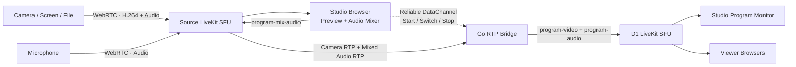

<div align="right">

**[English](README.md) | ไทย**

</div>

# LocalStream

ระบบห้องส่ง Live แบบ WebRTC สำหรับรับภาพจากกล้องหลายตัว เลือกภาพ Program หนึ่งช่อง ผสมเสียงจากหลายแหล่ง และกระจายผลลัพธ์สุดท้ายให้ผู้ชมแบบ Real-time

จุดเด่นของระบบปัจจุบัน:

- ใช้มือถือ คอมพิวเตอร์ กล้องเว็บแคม หน้าจอ หรือไฟล์เป็น Source ได้
- สลับกล้องที่ Go RTP Bridge โดยไม่ encode วิดีโอซ้ำ
- ผสมและปรับระดับเสียงแต่ละ Source ที่หน้า Studio
- แยก Source Room ออกจาก Program Room ที่ผู้ชมเข้าถึง
- ผู้ชมรับเพียง `program-video` 1 track และ `program-audio` 1 track
- รองรับการทดสอบกล้องและไมโครโฟนจากอุปกรณ์อื่นใน LAN ผ่าน HTTPS/WSS

> โปรเจกต์นี้ยังเป็น local-development setup ค่า API key, secret และ local CA ที่มากับระบบห้ามนำไปใช้ Production โดยไม่เปลี่ยน configuration

## Architecture



ระบบแบ่งเป็นสองฝั่ง:

1. **Source side** รับกล้องและไมโครโฟนดิบทั้งหมดสำหรับ Studio และ Go Bridge
2. **Program side (D1)** รับเฉพาะภาพที่เลือกและเสียงที่ผสมแล้วสำหรับผู้ชม

ผู้ชมไม่เข้า Source Room และไม่เห็น `camera-video`, `camera-audio` หรือ `microphone-audio`

## Docker services

`make infra-up` เปิดทั้งหมด 7 services:

| Service | หน้าที่ |
| --- | --- |
| `frontend` | Next.js UI และ BFF proxy สำหรับ `/api/token`, `/api/rooms`, `/api/bridge` |
| `backend` | Go Control API, ออก JWT, จัดการห้อง และรัน RTP Bridge |
| `livekit` | Source SFU รับ Source ดิบทั้งหมด |
| `redis` | State backend สำหรับ Source LiveKit |
| `d1` | Program SFU กระจาย Program Output ให้ Studio monitor และ Viewer |
| `redis-d1` | State backend สำหรับ D1 LiveKit |
| `caddy` | HTTPS สำหรับหน้าเว็บและ WSS reverse proxy สำหรับ LiveKit signaling |

Go RTP Bridge ไม่ได้เป็น container แยก แต่ทำงานอยู่ภายใน `backend` container และสร้าง session เมื่อ Studio เรียก `/api/bridge`

## Media flow

### Camera source

หน้า `/camera` ทำงานดังนี้:

1. ตรวจ Room Code กับ Go API
2. ขอ JWT สำหรับ Source Room
3. ขอสิทธิ์กล้องและไมโครโฟนจาก Browser
4. Encode และ publish `camera-video` เป็น H.264 พร้อม `camera-audio`
5. ส่ง Media ผ่าน WebRTC ไป Source LiveKit

กล้องเริ่มต้นบนมือถือเป็น **กล้องหลัง** ผู้ใช้เลือกกล้องหน้า/หลังก่อนเชื่อมต่อ หรือกด **สลับกล้อง** ขณะ Live ได้โดย Source identity และ publication เดิมไม่เปลี่ยน

### Microphone source

หน้า `/microphone` publish `microphone-audio` อย่างเดียว พร้อมเปิด echo cancellation, noise suppression และ automatic gain control

### Studio

หน้า `/studio`:

- Subscribe กล้องและเสียงจาก Source Room เพื่อ preview
- เลือกกล้องที่จะเป็น Program
- ลดกล้องที่ไม่ได้เลือกเป็นคุณภาพ LOW และขอกล้อง Program เป็น HIGH
- ผสมเสียงด้วย Web Audio API
- Publish เสียงรวมกลับ Source Room เป็น `program-mix-audio`
- ส่ง `program-start`, `program-switch`, `program-stop` ให้ Bridge ผ่าน reliable DataChannel
- Subscribe Program Room บน D1 เพื่อดูผลลัพธ์เดียวกับผู้ชม

### Go RTP Bridge

Bridge subscribe `camera-video` และ `program-mix-audio` จาก Source LiveKit จากนั้น:

- เลือกส่งวิดีโอจากกล้องที่ Studio กำหนด
- ส่ง RTCP PLI เพื่อขอ H.264 IDR keyframe เมื่อเริ่มหรือสลับกล้อง
- รอ keyframe ก่อนปล่อยภาพใหม่
- Rewrite RTP sequence number และ timestamp ให้ Program track ต่อเนื่อง
- Publish `program-video` และ `program-audio` ไป D1
- Forward คำขอ keyframe จากฝั่งผู้ชมกลับไปยังกล้องที่ active

วิดีโอเป็น RTP passthrough จึงไม่มี Canvas capture และไม่มี video encode รอบที่สอง ส่วนเสียงถูก mix และ encode ใหม่ที่ Browser ของ Studio

### Viewer

หน้า `/watch` เข้าเฉพาะ D1 Program Room ด้วย token แบบ subscribe-only และ subscribe เฉพาะ:

- `program-video`
- `program-audio`

จำนวน Source ที่เพิ่มขึ้นจึงไม่เพิ่มจำนวน track ที่ Viewer แต่ละคนต้องรับ ภาระฝั่ง D1 จะเพิ่มตามจำนวนผู้ชมแทน

## Requirements

สำหรับการรันระบบทั้งหมดด้วย Docker:

- Docker Desktop หรือ Docker Engine ที่รองรับ Docker Compose
- `make`
- macOS สำหรับ LAN IP auto-detection ใน script ปัจจุบัน

สำหรับรัน source code นอก Docker:

- Node.js 20+
- Go 1.26+

อุปกรณ์ที่จะใช้เป็นกล้องหรือไมโครโฟนต้องมี Browser ที่รองรับ WebRTC และ `getUserMedia()`

## Quick start

จาก repository root:

```bash
make infra-up
```

คำสั่งนี้จะ:

1. หา LAN IP จาก `en0` หรือ `en1`
2. Build Frontend และ Backend images
3. เปิด Docker services ทั้งหมด
4. ตั้ง LiveKit ให้ advertise LAN IP
5. แสดง URL สำหรับเปิดจากเครื่องอื่น

ตรวจสถานะ:

```bash
docker compose -f infrastructure/docker-compose.yml ps
```

เปิดจากเครื่อง Server:

```text
Channels:   http://localhost:3001/channels
Camera:     http://localhost:3001/camera
Microphone: http://localhost:3001/microphone
Studio:     http://localhost:3001/studio
Viewer:     http://localhost:3001/watch
API health: http://localhost:8080/health
```

หยุดระบบ:

```bash
make infra-down
```

คำสั่งนี้ไม่ลบ Docker volumes หากต้องการลบข้อมูล Redis และสร้าง local CA ใหม่ทั้งหมดให้ใช้ `down -v` ด้วยความระมัดระวัง

## วิธีใช้งาน

1. เปิด `/channels` และสร้าง Broadcast Room
2. คัดลอก Room Code 6 ตัว
3. เปิด `/camera` หรือ `/microphone` บนอุปกรณ์ Source
4. กรอก Room Code และอนุญาตกล้อง/ไมโครโฟน
5. เปิด Studio ของห้องนั้น
6. เลือกกล้อง Program และเลือกเสียงที่จะผสม
7. กดเริ่มถ่ายทอดสด
8. เปิด `/watch?channel=ROOM_ID` เพื่อรับชม

Room records เก็บอยู่ใน memory ของ Go process เท่านั้น เมื่อ `backend` restart รายการห้องและ Room Code เดิมจะหาย ต้องสร้างห้องใหม่

## ใช้มือถือหรือเครื่องอื่นผ่าน LAN

Browser ไม่อนุญาตให้เว็บบน LAN IP แบบ HTTP เปิดกล้องหรือไมโครโฟน ระบบจึงใช้ Caddy ออก local certificate และให้บริการผ่าน HTTPS

### 1. เชื่อมเครือข่ายเดียวกัน

เครื่อง Server และมือถือควรอยู่ Wi-Fi/LAN เดียวกัน หลีกเลี่ยง Guest Wi-Fi ที่เปิด client isolation

### 2. เริ่มระบบและดู LAN IP

```bash
make infra-up
```

ตัวอย่าง output:

```text
LiveKit is advertising 192.168.1.10 to WebRTC clients
LAN application: https://192.168.1.10:3443
Install the LAN CA certificate first: http://192.168.1.10:8081/root.crt
```

ถ้า script หา IP ไม่ถูก ให้กำหนดเอง:

```bash
LIVEKIT_NODE_IP=192.168.1.10 make infra-up
```

### 3. ติดตั้ง Caddy local CA บนอุปกรณ์

เปิด URL นี้จากอุปกรณ์ที่จะทดสอบ:

```text
http://LAN_IP:8081/root.crt
```

#### iPhone / iPad

1. เปิด URL ด้วย Safari และดาวน์โหลด profile
2. ไปที่ **Settings > General > VPN & Device Management** แล้วติดตั้ง profile
3. ไปที่ **Settings > General > About > Certificate Trust Settings**
4. เปิด Full Trust ให้ Caddy Local Authority

#### Android

ติดตั้งเป็น CA certificate จากเมนู Security หรือ Encryption & credentials ชื่อเมนูอาจต่างกันตามผู้ผลิตและ Android version

#### macOS เครื่องอื่น

เพิ่ม certificate ใน Keychain Access แล้วตั้ง Trust เป็น Always Trust

CA private key อยู่ใน Docker volume `caddy-data` และไม่ได้ถูกเปิดให้ดาวน์โหลด ห้ามคัดลอกหรือแจก CA private key

### 4. เปิดหน้า HTTPS

แทน `LAN_IP` ด้วย IP ที่ script แสดง:

```text
Channels:   https://LAN_IP:3443/channels
Camera:     https://LAN_IP:3443/camera
Microphone: https://LAN_IP:3443/microphone
Studio:     https://LAN_IP:3443/studio
Viewer:     https://LAN_IP:3443/watch
```

หน้า Camera จะขอใช้กล้องหลังเป็นค่าเริ่มต้น และมีปุ่มสำหรับสลับกล้องหน้า/หลัง

### 5. Firewall

อนุญาต inbound ports ต่อไปนี้บนเครื่อง Server:

| Port | Protocol | หน้าที่ |
| --- | --- | --- |
| `3443` | TCP | Caddy HTTPS application |
| `7443` | TCP | Source LiveKit WSS signaling |
| `7444` | TCP | D1 LiveKit WSS signaling |
| `8081` | TCP | ดาวน์โหลด public CA certificate |
| `7881` | TCP | Source WebRTC media fallback |
| `7882` | UDP | Source WebRTC media |
| `7981` | TCP | D1 WebRTC media fallback |
| `7982` | UDP | D1 WebRTC media |

Caddy proxy เฉพาะ HTTPS/WSS signaling ส่วน RTP/SRTP media วิ่งตรงระหว่างอุปกรณ์กับ LiveKit ผ่าน UDP/TCP

## Ports

| Port | Service | Exposure |
| --- | --- | --- |
| `3001/TCP` | Next.js frontend | Direct localhost/LAN HTTP สำหรับหน้า Viewer หรือ debug |
| `8080/TCP` | Go Control API | Direct API/debug |
| `7880/TCP` | Source LiveKit signaling | Direct WS/debug |
| `7881/TCP` | Source WebRTC TCP | Media fallback |
| `7882/UDP` | Source WebRTC UDP | Media path หลัก |
| `7980/TCP` | D1 LiveKit signaling | Direct WS/debug |
| `7981/TCP` | D1 WebRTC TCP | Media fallback |
| `7982/UDP` | D1 WebRTC UDP | Media path หลัก |
| `3443/TCP` | Caddy | LAN HTTPS application |
| `7443/TCP` | Caddy | Source WSS gateway |
| `7444/TCP` | Caddy | D1 WSS gateway |
| `8081/TCP` | Caddy | Public CA certificate download |

Redis port `6379` ไม่ถูก publish ออกจาก Docker network

## API และ BFF

Browser เรียก Next.js BFF แบบ same-origin แล้ว BFF proxy ต่อไปยัง Go Backend:

```text
Browser -> Next.js BFF -> Go Control API
```

| Endpoint | หน้าที่ |
| --- | --- |
| `POST /api/token` | ออก LiveKit JWT ตาม role และ target |
| `GET /api/rooms` | แสดงห้องหรือค้นหาด้วย Room Code |
| `POST /api/rooms` | สร้างห้องใหม่ |
| `POST /api/bridge` | สร้างหรือยืนยัน Program Bridge session |
| `GET /health` | Backend health check |

Roles:

- `broadcaster`: publish และ subscribe ใน Source Room
- `monitor`: subscribe-only ใน D1 Program Room
- `viewer`: subscribe-only ใน D1 Program Room

ห้ามส่ง LiveKit API secret ไป Browser เด็ดขาด Browser ควรได้รับเฉพาะ JWT อายุสั้นจาก Backend

## WebRTC protocols ที่ใช้

| Protocol | หน้าที่ |
| --- | --- |
| WebRTC | ชุดกลไกเชื่อม media/data แบบ Real-time |
| RTP/SRTP | ขนส่ง media packets และเข้ารหัสบน network |
| RTCP | Feedback, packet statistics และ PLI/FIR สำหรับขอ keyframe |
| ICE | หาเส้นทางเชื่อมต่อระหว่าง Browser กับ LiveKit |
| DTLS | เจรจากุญแจสำหรับ SRTP และ DataChannel |
| SCTP/DataChannel | ส่งคำสั่งควบคุม Start/Switch/Stop แบบ reliable |

Config ปัจจุบันเหมาะกับ LAN และยังไม่มี TURN server อุปกรณ์นอก LAN หรือเครือข่ายที่บล็อก UDP อาจเชื่อมต่อไม่ได้

## Configuration

ค่าหลักที่ใช้ได้:

```bash
LIVEKIT_NODE_IP=192.168.1.10

LIVEKIT_API_KEY=devkey
LIVEKIT_API_SECRET=replace-me
LIVEKIT_URL=ws://127.0.0.1:7880
LIVEKIT_INTERNAL_URL=ws://livekit:7880

D1_LIVEKIT_API_KEY=d1key
D1_LIVEKIT_API_SECRET=replace-me
D1_LIVEKIT_URL=ws://127.0.0.1:7980
D1_LIVEKIT_INTERNAL_URL=ws://d1:7980

CONTROL_API_URL=http://backend:8080
LIVEKIT_PUBLIC_URL=wss://192.168.1.10:7443
D1_LIVEKIT_PUBLIC_URL=wss://192.168.1.10:7444

ALLOWED_ORIGINS=https://192.168.1.10:3443
ALLOW_PRIVATE_ORIGINS=true
```

ค่าที่ check in อยู่เป็น development credentials เท่านั้น ก่อนใช้บน shared network หรือ Production ต้องเปลี่ยน API keys/secrets และจำกัด allowed origins

## Local development นอก Docker

Docker workflow เป็นเส้นทางหลัก หากต้องการ hot reload ให้เปิดเฉพาะ infrastructure services ก่อน:

```bash
LIVEKIT_NODE_IP=127.0.0.1 docker compose -f infrastructure/docker-compose.yml up -d redis redis-d1 livekit d1
```

เปิด Backend:

```bash
cd backend
LIVEKIT_URL=ws://127.0.0.1:7880 \
D1_LIVEKIT_URL=ws://127.0.0.1:7980 \
go run ./cmd/api
```

เปิด Frontend อีก terminal:

```bash
cd frontend
npm install
CONTROL_API_URL=http://127.0.0.1:8080 npm run dev
```

Next.js development server ใช้ `http://localhost:3000` โดยปกติ `localhost` ถือเป็น secure context สำหรับการเปิดกล้องบนเครื่องเดียวกัน

## Tests

รันทั้งหมด:

```bash
make test
```

หรือแยก:

```bash
cd backend && go test ./...
cd frontend && npm run lint && npm run build
```

ตรวจ Docker Compose configuration:

```bash
LIVEKIT_NODE_IP=192.168.1.10 docker compose -f infrastructure/docker-compose.yml config
```

## Troubleshooting

### มือถือเปิดหน้าได้แต่ Browser ไม่ยอมใช้กล้อง

- ตรวจว่า URL เป็น `https://` ไม่ใช่ `http://`
- ตรวจว่าติดตั้งและเปิด Full Trust ให้ Caddy CA แล้ว
- ปิดและเปิด Browser ใหม่หลังติดตั้ง certificate
- ตรวจสิทธิ์ Camera/Microphone ของ Browser ในระบบปฏิบัติการ

### เปิด `https://LAN_IP:3443` ไม่ได้

- ตรวจว่ามือถือและ Server อยู่เครือข่ายเดียวกัน
- ตรวจ IP ที่ `make infra-up` แสดง
- ตรวจว่า Guest Wi-Fi ไม่ได้เปิด client isolation
- ตรวจ firewall และ port `3443`
- ดู log ด้วย `docker compose -f infrastructure/docker-compose.yml logs caddy`

### หน้าเว็บเปิดได้แต่เชื่อม LiveKit ไม่ได้

- ตรวจ WSS ports `7443` และ `7444`
- ตรวจ media ports UDP `7882`, `7982` และ TCP fallback `7881`, `7981`
- ตรวจว่า LiveKit advertise IP ตรงกับ LAN IP ปัจจุบัน
- เมื่อเปลี่ยน Wi-Fi หรือ IP ให้รัน `make infra-up` ใหม่

### ติดตั้ง CA แล้วแต่ certificate ยังผิด

- ตรวจว่าเปิด URL ด้วย IP เดียวกับที่ `make infra-up` แสดง
- หากเคยใช้ `docker compose down -v` local CA จะถูกสร้างใหม่ ต้องติดตั้ง `root.crt` ใหม่
- ลบ profile/certificate เก่าที่ชื่อ Caddy Local Authority แล้วติดตั้งใหม่เมื่อจำเป็น

### ห้องที่สร้างไว้หาย

Room directory อยู่ใน memory ของ Go Backend การ restart หรือ rebuild `backend` จะล้างห้องทั้งหมด นี่เป็นข้อจำกัดของ local version ปัจจุบัน

### Viewer มีภาพดำหลังเริ่มหรือสลับกล้อง

- ตรวจว่ากล้อง publish H.264 สำเร็จ
- ตรวจ log ของ Backend ว่า Bridge ได้รับ Source และ keyframe หรือไม่
- ตรวจว่า Studio เลือกกล้องที่มี `camera-video`
- ตรวจ RTCP PLI/keyframe timeout ใน Backend logs

## Project structure

```text
.
├── backend/
│   └── cmd/api/              Go Control API และ RTP Bridge
├── frontend/
│   └── src/app/              Next.js pages และ BFF routes
├── infrastructure/
│   ├── docker-compose.yml    Docker services ทั้งหมด
│   ├── Caddyfile             LAN HTTPS/WSS gateway
│   ├── livekit.yaml          Source SFU configuration
│   └── livekit-d1.yaml       D1 SFU configuration
├── scripts/
│   └── start-local.sh        LAN IP detection และ startup
├── README.md                 เอกสารภาษาอังกฤษ
├── README.th.md              เอกสารภาษาไทย
└── Makefile
```

## Current limitations

- Room records ไม่ persistent
- ยังไม่มี TURN server
- Local CA ต้องติดตั้งและ trust บนอุปกรณ์ทดสอบทุกเครื่อง
- Go Bridge รับ video publications จากกล้องทั้งหมด แม้ส่งออกเพียงกล้อง active
- Studio Browser เป็นผู้ preview กล้องและ mix เสียง จึงอาจหนักเมื่อมี Source จำนวนมาก
- Development secrets ถูกเก็บใน Compose/config files และต้องเปลี่ยนก่อนใช้งานจริง
- ยังไม่มีระบบผู้ใช้, login, database, recording หรือ production observability

สำหรับ Production ควรเพิ่ม domain และ public TLS certificate, TURN, persistent database, secret management, authentication, monitoring และแผน scale สำหรับ Source SFU/D1 ตามจำนวน Source และ Viewer
