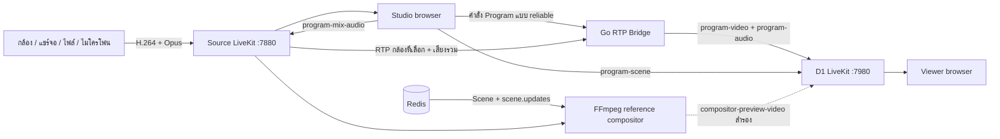

# LocalStream

ระบบถ่ายทอดสดหลายแหล่งสัญญาณแบบหน่วงต่ำผ่านเว็บเบราว์เซอร์บนเครือข่ายภายใน กล้อง ไมโครโฟน Studio และ Viewer เชื่อมผ่าน LiveKit SFU สองชุดที่แยกกันชัดเจน Go RTP Bridge ส่งต่อเฉพาะกล้องที่เลือกโดยไม่ถอด/เข้ารหัสวิดีโอใหม่ ส่วน Studio ผสมเสียงด้วย Web Audio API และส่งข้อมูล Scene ผ่าน LiveKit DataChannel

English: [README.md](README.md)

> ใช้เพื่อพัฒนา/ศึกษาใน LAN เท่านั้น โปรเจกต์มี API key แบบคงที่และใช้ Local CA ของ Caddy ก่อนเปิดสู่อินเทอร์เน็ตต้องเปลี่ยน secret, เพิ่ม authentication/authorization, จำกัด CORS และใช้ TLS ที่เชื่อถือได้

## สถาปัตยกรรมปัจจุบัน



เส้นทางหลักที่ Viewer ใช้จริงเลือก `program-video` จาก RTP Bridge ก่อน แล้ววาด image layers ทับในเบราว์เซอร์จาก `program-scene` ส่วน `compositor-preview-video` เป็นเส้นทางทดลอง/สำรอง Backend มี Scene REST API, Redis และ Pub/Sub สำหรับ compositor แต่ Studio ปัจจุบันยังไม่ได้ PUT ทุกการแก้ไข Scene กลับ API

## Service และพอร์ต

| Service | Host port | หน้าที่ |
|---|---:|---|
| Frontend | `3001` | Next.js UI และ BFF แบบ same-origin |
| Control API | `8080` | Token, room, bridge, scene, asset |
| Source LiveKit | `7880`, `7881/tcp`, `7882/udp` | ห้องทำงานที่เก็บ source ทั้งหมด |
| D1 LiveKit | `7980`, `7981/tcp`, `7982/udp` | ห้อง Program สำหรับ Studio monitor/Viewer |
| Compositor | `8090` | health, readiness, metrics ของ worker |
| Caddy | `3443`, `7443`, `7444`, `8081` | HTTPS/WSS ใน LAN และแจก root certificate |
| Redis 2 ชุด | ภายใน Docker | Scene state และ state ของ LiveKit แต่ละชุด |

Docker Compose มี 8 services: Redis สองชุด, LiveKit สองชุด, backend, frontend, compositor และ Caddy

## เริ่มใช้งาน

ต้องมี Docker Desktop และ POSIX shell สคริปต์ค้นหา LAN IP อัตโนมัติด้วย `ipconfig` ของ macOS; ระบบอื่นให้กำหนด IP เอง

```bash
make infra-up
```

หรือ:

```bash
LIVEKIT_NODE_IP=192.168.1.10 make infra-up
```

URL สำคัญ:

- Dashboard: `http://localhost:3001/channels`
- Camera: `http://localhost:3001/camera`
- Microphone: `http://localhost:3001/microphone`
- Studio: `http://localhost:3001/studio`
- Viewer: `http://localhost:3001/watch`
- ใช้จากอุปกรณ์ใน LAN: `https://<LAN_IP>:3443`

มือถือจำเป็นต้องติดตั้งและ Trust `http://<LAN_IP>:8081/root.crt` ก่อนเปิด `https://<LAN_IP>:3443/camera` สัญญาณ WebSocket ผ่าน Caddy ที่ `:7443` (Source) และ `:7444` (D1) แต่ media วิ่งตรงเข้าพอร์ต TCP/UDP ที่ LiveKit ประกาศ

หยุดระบบด้วย:

```bash
make infra-down
```

### ทดสอบ D1 จริง (Ant Media) โดยไม่กระทบ D1 เดิม

เปิด `https://<LAN_IP>:3443/d1-test` (หรือ `http://localhost:3001/d1-test`) แล้วกด **เริ่มทดสอบส่งไป D1 จริง** หน้าแยกนี้จะ publish กล้องและไมค์ตรงไป Ant Media ด้วยค่าเริ่มต้น:

- WebSocket: `wss://rtc2.streamssl.com:5443/WebRTCAppEE/websocket`
- Stream Key / Ant Media Stream ID: `sell-image`

เส้นทาง LiveKit D1 เดิม, Studio, Viewer และ RTP Bridge ไม่ถูกเปลี่ยน จึงใช้งานต่อได้ตามปกติ หากปลายทางเปิด publish security ให้กรอก Publish Token ในหน้าทดสอบด้วย สามารถ override ค่าเริ่มต้นของ Docker ผ่าน `ANT_MEDIA_WEBSOCKET_URL` และ `ANT_MEDIA_STREAM_ID` ก่อนรัน Compose

หน้าทดสอบแสดงภาพสองช่อง: **LOCAL / ส่งออก** คือภาพก่อนส่ง และ **D1 RETURN / รับกลับ** มาจาก WebRTC player connection อีกเส้นหนึ่ง เมื่อเห็น `D1 ACCEPTED`, `RETURN RECEIVED` และภาพในช่อง Return เปลี่ยนตามกล้อง จึงยืนยันได้ทั้งขา publish และขา play จาก D1 หาก server เปิด stream security อาจต้องใช้ Publish Token และ Play Token คนละค่า

Connection Console ด้านล่างบันทึก event ของ Publish, Return และ Audio พร้อมพิมพ์ซ้ำใน Browser DevTools Console ด้วย prefix `[D1 ...]` หลังเชื่อมต่อสำเร็จสามารถเปิดเสียง Return แล้วกด **ส่ง Test Sound ไป D1** เพื่อ inject เสียง 880 Hz เป็นเวลา 650 ms เข้า outgoing audio track จริง แนะนำให้ใช้หูฟังเพื่อป้องกันเสียงวนกลับเข้าไมค์

## ขั้นตอนจัดรายการ

1. สร้างห้องที่ `/channels` Backend จะสร้าง code 6 ตัวและ room ID เช่น `room-ab12cd`
2. เปิด `/camera` หรือ `/microphone` กรอก code และอนุญาตใช้อุปกรณ์
3. เปิดลิงก์ Studio ที่ระบบสร้างให้ Studio จะเข้า Source room, สั่งสร้าง Bridge และเข้า `<room-id>-program` บน D1 ในบทบาท monitor
4. เพิ่ม/เลือกกล้องใน Scene เลือกเสียงที่จะใช้และปรับ volume แล้วกดเริ่มถ่ายทอดสด
5. แชร์ `/watch?channel=<room-id>` โดยค่า `channel` ต้องเป็น room ID ไม่ใช่ code 6 ตัว

ก่อนกด **เข้าควบคุม Studio** สามารถเลือก `Program Destination` ได้สองแบบ:

- `LiveKit D1 เดิม` ใช้ Bridge, Program room และ Viewer เดิมทั้งหมด
- `D1 จริง / Custom Ant Media` รับหลายกล้องและหลายไมค์จาก Source room เหมือน Studio เดิม แต่ส่งกล้อง Program และ audio mix ไปยัง WebRTC WebSocket URL / Stream Key ที่กรอก การกด Cut จะเปลี่ยน video track บน publisher เดิมโดยไม่ reconnect และ Program Monitor จะแสดง Return ที่เล่นกลับจาก Ant Media

โหมด Ant Media ไม่ต้องเชื่อม LiveKit D1 หรือสร้าง Bridge แต่ยังต้องเชื่อม Source LiveKit เพื่อรับกล้องและไมค์ ขณะนี้ Scene image overlays เป็น metadata/UI ของ Studio และไม่ได้ burn ลงในวิดีโอ Ant Media

Camera ส่ง H.264 1080p/30 แบบ single encoding ไม่ใช้ simulcast ชื่อ track `camera-video` และส่ง `camera-audio` ถ้ามี เพดาน bitrate วิดีโอ 6 Mbps หน้า Camera รองรับกล้อง, แชร์หน้าจอ, ไฟล์วิดีโอ และไฟล์ภาพ ส่วนหน้า Microphone ส่ง `microphone-audio`

เมื่อเริ่มออกอากาศ Studio จะผสม source เสียงที่เปิดไว้เป็น `program-mix-audio`, ส่ง `program-start` ให้ Bridge/Compositor และส่ง `program-scene` แบบ reliable บน D1 เมื่อ Cut กล้อง Bridge จะขอ IDR keyframe รอ keyframe แล้วเขียน RTP sequence/timestamp ใหม่เพื่อให้สตรีมปลายทางต่อเนื่อง

## พฤติกรรม Scene

- Output ถูกบังคับเป็น 1920×1080 ที่ 60 fps
- ชุด Scene ของ Studio เก็บรายห้องใน `localStorage` key `localstream-studio-scenes:<room>`
- Asset PNG/JPEG/WebP/GIF ขนาดไม่เกิน 5 MiB เก็บแบบ content-addressed ใน Docker volume `asset-data`
- Scene REST API เก็บ Scene เดียวต่อ room ใน Redis และ publish `scene.updates`; revision เก่าหรือเท่าปัจจุบันได้ HTTP 409
- Studio โหลด server scene ตอนเปิด แต่การแก้ไขชุด Scene อยู่ใน localStorage และจะส่งให้ Viewer เมื่อ Program เปลี่ยน
- Viewer ที่เพิ่งเข้าได้รับ snapshot ล่าสุดเมื่อ Studio ยังเชื่อม D1 และตรวจพบ participant ใหม่

## พัฒนาและทดสอบ

```bash
make test                 # Go tests + frontend lint + production build
make backend              # Control API ที่ :8080
make frontend             # Next.js dev server
./load-test.sh --help     # ทดสอบ Token API และ LiveKit subscribers
```

เมื่อรัน backend เดี่ยวโดยไม่มี `REDIS_URL` Scene จะอยู่ใน memory และควรกำหนด `ASSET_DIR` ให้เป็น path ที่เขียนได้ การทดสอบ media workflow ครบเส้นทางยังต้องใช้ LiveKit ทั้งสองชุด

## ข้อจำกัดปัจจุบัน

- Room directory อยู่ใน memory ของ backend หายเมื่อ restart และไม่แชร์ระหว่าง backend replicas
- ไม่มี login หรือสิทธิ์ระดับห้อง ผู้ที่เข้าถึง Token API สามารถขอ role ที่ระบบรองรับได้
- Bridge session อยู่ใน backend process เดียว ไม่มี API cleanup/recovery และไม่รองรับ distributed ownership
- Program video สมมติว่าเป็น H.264 และตัวตรวจ keyframe ของ Bridge เข้าใจ H.264 โดยเฉพาะ
- Audio mixer อยู่ใน Studio browser; ปิดแท็บแล้ว publisher เสียงรวมจะหยุด และ Viewer ใหม่จะไม่ได้ Scene snapshot จาก Studio
- จำนวนผู้ชมคือนับ participant บน D1 ที่ identity ขึ้นต้น `viewer-` เท่านั้น
- FFmpeg compositor เป็น CPU reference (`libx264`) และ UI ปัจจุบันตั้งใจเลือก passthrough video ก่อน
- CORS ที่ยอม private/loopback origin พอร์ต 3000/3001 โดยค่าเริ่มต้นมีไว้สำหรับ local development ไม่ใช่มาตรการ production

## เอกสารเพิ่มเติม

- [Flow การทำงานและการไหลของ media แบบละเอียด](flow.md)
- [แนวคิด WebRTC ที่ผูกกับโค้ดโปรเจกต์นี้](webrtc_concepts.md)
- [API Specification ภาษาไทย](api_spec.th.md)
- [API Specification ภาษาอังกฤษ](api_spec.md)

## โครงสร้าง repository

```text
backend/cmd/api/          Control API, room store, RTP bridge, scene, asset
backend/cmd/compositor/   Redis consumer และ FFmpeg reference compositor
frontend/src/app/         Next.js pages และ BFF route handlers
frontend/src/lib/         API client, channel naming, scene types
infrastructure/           Docker Compose, LiveKit, Caddy
scripts/start-local.sh    หา LAN IP และเปิดระบบ
load-test.sh              ทดสอบ Token API และ LiveKit subscriber load
```
