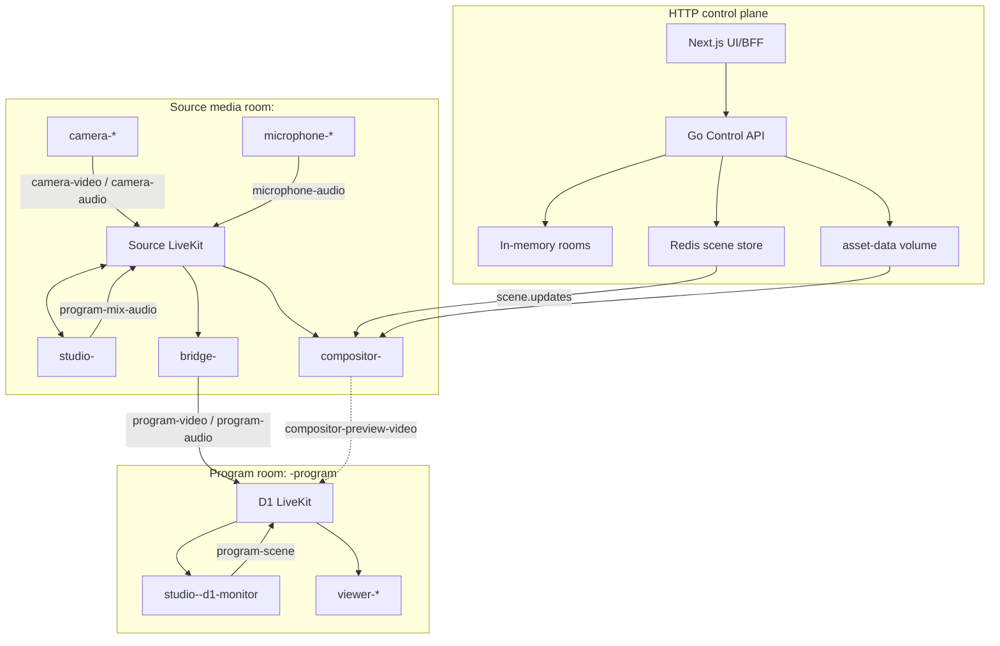
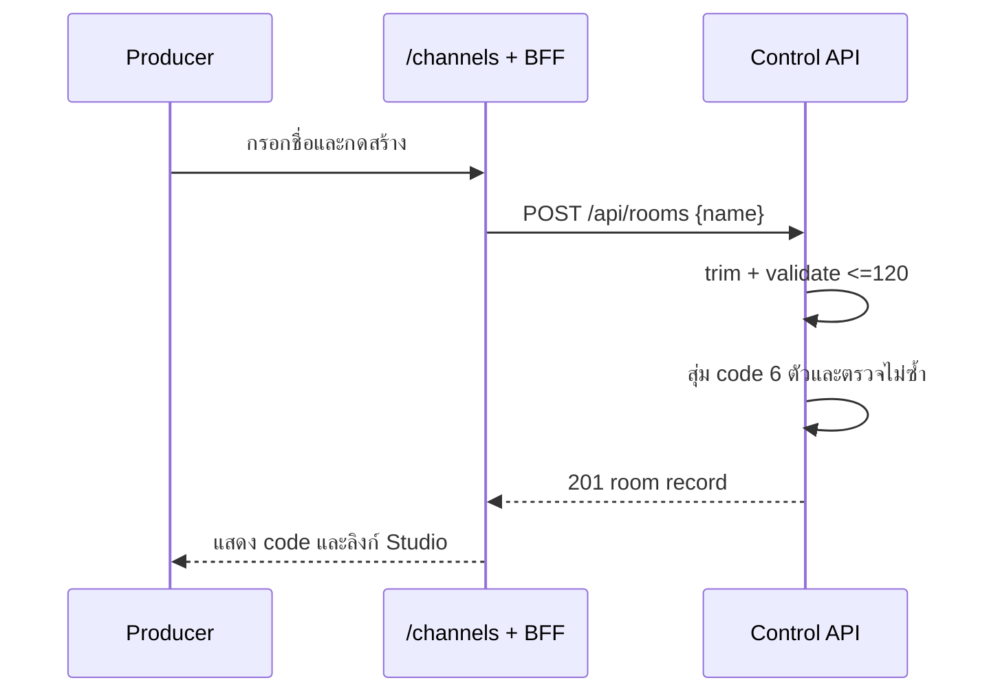
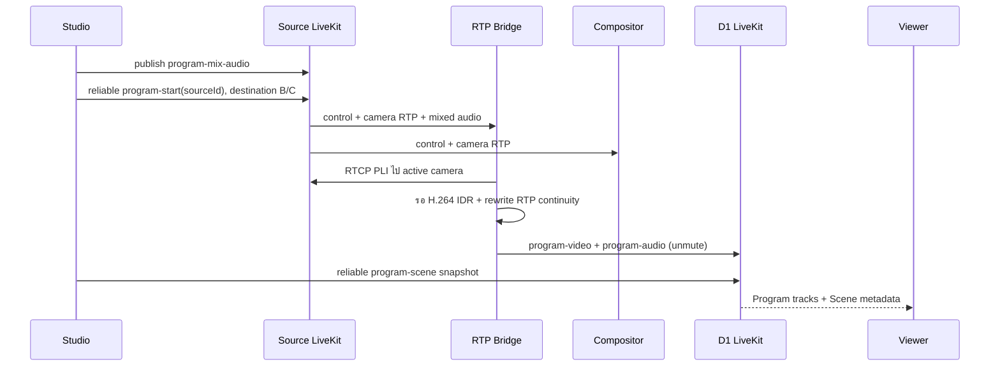

# LocalStream Application Flow

เอกสารนี้ไล่ flow จากการเปิดระบบจนหยุดออกอากาศ โดยระบุ room, identity, track และ control message ตามโค้ดปัจจุบัน

## ภาพรวม 4 plane



## 0. เปิดระบบ

`make infra-up` เรียก `scripts/start-local.sh`:

1. หา `LIVEKIT_NODE_IP` จาก `en0`, ต่อด้วย `en1`, และ fallback เป็น `127.0.0.1`
2. รัน Docker Compose พร้อม build backend/frontend/compositor
3. Source LiveKit ใช้ Redis ชุดแรก; D1 ใช้ Redis D1 แยกกัน
4. Backend เชื่อมทั้ง LiveKit ผ่าน internal Docker URLs และเปิด Control API `:8080`
5. Frontend proxy API ไป backend และคืน public WSS URLs ผ่าน Caddy
6. Compositor ping Redis, โหลด key `scene:*`, subscribe `scene.updates`, แล้วเปิด `:8090`
7. Caddy ให้ HTTPS แอปที่ `:3443`, WSS Source/D1 ที่ `:7443/:7444`, และ root CA ที่ `:8081/root.crt`

ถ้า LAN IP ผิด WebSocket อาจเปิดได้จากเครื่อง host แต่ media candidate ที่อุปกรณ์อื่นได้รับจะผิด ทำให้ไม่มีภาพ/เสียง

## 1. สร้างห้อง



ตัวอย่าง mapping:

```text
Room code:       ABC234             ใช้ให้ Camera/Mic ค้นหาห้อง
Source room ID:  room-abc234        ใช้เป็น LiveKit room จริง
Studio identity: studio-room-abc234
Program room:    room-abc234-program
```

Room record อยู่ใน map ของ backend เท่านั้น เมื่อ backend restart code เดิมค้นหาไม่ได้ แม้ LiveKit/Redis volume ยังอยู่

## 2. Camera เชื่อม Source room

1. หน้า `/camera` สร้าง identity `camera-<random-8>`
2. ผู้ใช้เลือก `camera`, `screen` หรือ `file` และกรอก code
3. `GET /api/rooms?code=...` resolve code เป็น room record
4. Browser ขอ media:
   - camera: 1920×1080 ideal, 30 fps, front/back camera และเสียงพร้อม echo cancellation/noise suppression/AGC
   - screen: `getDisplayMedia({video:true,audio:true})`
   - video file: `<video>.captureStream()` และเล่น loop
   - image file: วาดลง canvas 1920×1080 แล้ว `captureStream(30)`
5. ขอ token role `broadcaster`, target `source`
6. เชื่อม Source LiveKit ด้วย `adaptiveStream:false`, `dynacast:false`
7. Publish video H.264 แบบไม่ simulcast ชื่อ `camera-video`, source Camera, สูงสุด 6 Mbps/30 fps
8. ถ้ามี audio publish clone ชื่อ `camera-audio`
9. ตั้ง subscription permission ให้เฉพาะ `studioIdentity`, `bridge-<room>` และ `compositor-<room>`

การสลับกล้องหน้า/หลังขณะ connected ใช้ `restartTrack()` บน publication เดิม จึงไม่สร้าง participant/track ใหม่ หากล้มเหลวจะพยายาม restore facing mode เดิมหนึ่งครั้ง

## 3. Microphone เชื่อม Source room

Flow เหมือน Camera ถึงขั้น resolve room/token แต่ขอ audio อย่างเดียว, identity เป็น `microphone-<random>`, publish `microphone-audio` และอนุญาต subscriber เฉพาะ Studio หน้า Mic mute/unmute publication ได้โดยไม่ disconnect

## 4. Studio โหลด Scene และเชื่อมสองห้อง

เมื่อเปิด `/studio?channel=<room-id>&code=<code>`:

1. อ่าน `channel` ที่ยอมเฉพาะ `[a-z0-9-]{1,128}`; ถ้าผิดใช้ `channel-1`
2. `GET /api/scenes/<room-id>` เพื่อโหลด server scene/default
3. ตรวจ legacy local key `localstream-scene:<room>` เฉพาะกรณี server scene ไม่มี layers
4. โหลด scene collection ใหม่จาก `localstream-studio-scenes:<room>` ถ้ามี; มิฉะนั้นสร้าง Scene 1 จาก server scene
5. บันทึกการแก้ collection กลับ localStorage แต่ยังไม่ PUT Scene API อัตโนมัติ

เมื่อกดเข้าควบคุม Studio:

1. ขอ broadcaster token และเชื่อม Source room เป็น `studio-<room>` พร้อม auto-subscribe
2. สร้างรายการ Camera จาก participant prefix `camera-` และรายการเสียงจาก `camera-`/`microphone-`
3. `POST /api/bridge {room}` เพื่อ ensure Bridge
4. Backend Bridge เข้า D1 room เป็น `program-<room>` ก่อน แล้วเข้า Source room เป็น `bridge-<room>`
5. Studio ขอ D1 token role `monitor` และเข้า `<room>-program` เป็น `studio-<room>-d1-monitor`
6. Studio ปิด auto-subscribe บน D1 แล้วเลือก subscribe เฉพาะ `program-video`, `program-audio`, `compositor-preview-video`
7. Studio นับ Viewer จาก remote identity prefix `viewer-`

ก่อน live หน้าจอ Program เป็น local confidence preview จาก Camera track ใน Source room หลัง live จะเปลี่ยนไปดู return feed จาก D1

## 5. จัด Preview, Scene และ Audio

Scene collection รองรับ add, duplicate, delete, select และกำหนดกล้องหลักของแต่ละ Scene Image layer รองรับ upload, move/resize, reorder z-index, show/hide, opacity, horizontal/vertical flip และ rotation

Asset upload flow:

1. Browser ตรวจว่าเป็น image และไม่เกิน 5 MiB
2. `POST /api/assets` ผ่าน BFF
3. Backend ตรวจ magic bytes, hash SHA-256, เขียนลง shared `asset-data`
4. Scene เก็บ URL `/api/assets/<hash>.<ext>` ไม่เก็บ file bytes ใน DataChannel

Audio:

1. ทุก audio source เริ่มต้น `enabled:false`, volume 100
2. ปุ่ม monitor attach remote track ให้ Producer ฟัง โดยไม่หมายความว่าเปิดเข้า Program
3. source ที่ enabled ถูกต่อผ่าน GainNode ไป MediaStreamDestination
4. เมื่อต้อง publish จะสร้าง track `program-mix-audio` ใน Source room แม้ไม่มี source ที่เปิดอยู่ publication จะถูก mute

## 6. เริ่มถ่ายทอดสด



รายละเอียด Bridge:

- subscribe เฉพาะ video track ชื่อ `camera-video` และ audio track ชื่อ `program-mix-audio`
- สร้าง output tracks ครั้งแรกเมื่อเห็น input codec แล้ว mute ไว้จน Start
- ถ้ายังไม่มี active source จะจำ camera ตัวแรก แต่จะไม่ส่งจน `started=true`
- Start/Switch ตั้ง active source, unmute publications, ขอ keyframe และ retry ทุก 250 ms สูงสุด 3 วินาที
- buffer แพ็กเก็ตใน timestamp เดียวจนพบ IDR จากนั้น forward พร้อม sequence/timestamp ใหม่
- audio ไม่เลือกตาม camera identity; mixed audio track เดียวที่ Studio publish จะถูก forward ตลอดช่วง started

## 7. Cut กล้องหรือ Scene

`performCut()` ทำสองส่วน:

1. ถ้ากล้อง Preview ต่างจาก Program และกำลัง live ให้ส่ง `program-switch`; ถ้ายังไม่ live เปลี่ยน local active camera เท่านั้น
2. copy Scene ที่เลือกเป็น Program Scene แล้วส่ง `program-scene` ไป D1

Bridge ทำ keyframe-safe switch ส่วน Viewer เปลี่ยน overlay จาก metadata ใหม่ ดังนั้น camera pixel switch กับ Scene message เป็นคนละ transport และไม่ได้ atomic ในระดับเฟรม อาจมีช่วงสั้นที่ภาพใหม่มาก่อน/หลัง overlay ใหม่

## 8. Viewer เข้าดู

1. `/watch?channel=<source-room-id>` derive Program room ด้วยการต่อ `-program`
2. ขอ token role `viewer`, target `d1`
3. เข้า D1 ด้วย `autoSubscribe:false`
4. subscribe เฉพาะ `program-video`, `program-audio`, `compositor-preview-video`
5. เลือก direct `program-video` ก่อนเสมอ; เลือก composed track เมื่อ direct ไม่มีและ composed ไม่ mute
6. attach `program-audio` ลง `<audio autoplay>`; ถ้า autoplay ถูก block แสดง action ให้ผู้ใช้เปิดเสียง
7. โหลด Scene ครั้งแรกจาก REST เพื่อมี fallback แล้วรับ `program-scene` updates จาก DataChannel
8. วาด `SceneOverlay` ทับ video ใน DOM
9. นับ Viewer จาก local/remote identity prefix `viewer-`

เมื่อ Viewer ใหม่ connect, Studio monitor บน D1 ตรวจ event และส่ง Scene ปัจจุบันตรงไป identity นั้น หาก Studio offline Viewer ยังโหลด server scene ได้ แต่เพราะ Studio ไม่ save edit ปัจจุบันอัตโนมัติ REST scene อาจไม่ตรงกับ Scene ล่าสุด

## 9. Reference Compositor flow

เส้นทางนี้มีใน stack แต่ยังไม่ใช่ video ที่ UI เลือกก่อน:

1. `PUT /api/scenes/<room>` เก็บ Redis key `scene:<room>` และ publish `scene.updates`
2. Worker validate ว่า asset ที่มองเห็นอยู่ใน shared volume แล้วสร้าง media session ต่อ Source/D1
3. subscribe H.264 `camera-video` และฟัง program control
4. เมื่อ Scene มี `sourceId` ที่ online สร้าง FFmpeg pipeline ใหม่
5. ส่ง input RTP ทาง UDP localhost เข้า FFmpeg
6. scale/pad base video เป็น 1920×1080, เรียง layer ตาม z-index, load เฉพาะ `/api/assets/`, apply scale/flip/rotation/overlay
7. encode `libx264`, ultrafast/zerolatency, baseline, 60 fps, GOP 60, 8 Mbps แล้วส่ง RTP localhost กลับ worker
8. worker publish `compositor-preview-video` ที่ D1 และ mute/unmute ตาม Start/Stop

ข้อสังเกต: FFmpeg filter ปัจจุบันไม่ได้ใช้ค่า `opacity` ใน overlay pipeline แม้ browser overlay ใช้ opacity และ Scene validation ยอมรับค่าไว้ นี่เป็นความต่างของ reference output กับ viewer-side overlay

## 10. หยุดถ่ายทอดสดและออกจาก Studio

Stop Broadcast:

1. ส่ง `program-stop` ไป Bridge/Compositor
2. ทั้งคู่ mute output publications
3. Studio unpublish/stop `program-mix-audio`
4. ปิด AudioContext/mixer nodes
5. Studio ยังอยู่สองห้องและ Camera ยังเชื่อม เพื่อเริ่มรายการใหม่ได้

Leave Studio/ปิดหน้า:

- disconnect Source และ D1 rooms
- ล้าง monitor/mixer state
- Camera/Mic ยังอยู่ Source room จนผู้ใช้หยุดเองหรือ connection หลุด
- Bridge session ใน backend ยังอยู่และไม่มี automatic cleanup; output ถูกหยุดก็ต่อเมื่อได้รับ `program-stop` ก่อน Studio หาย

## 11. Failure paths ที่ควรรู้

| อาการ | จุดที่ควรตรวจ |
|---|---|
| ขอ camera ไม่ได้บนมือถือ | เปิดผ่าน HTTPS และ Trust Local CA แล้วหรือไม่ |
| Connect ได้แต่ไม่มี media | `LIVEKIT_NODE_IP`, firewall TCP/UDP 7881/7882/7981/7982 |
| Studio เข้าไม่ได้ | backend `:8080`, Source/D1 internal URLs, token proxy |
| Start แล้วจอดำ | H.264 publication, `camera-video`, Bridge log เรื่อง keyframe timeout |
| ไม่มีเสียง Program | source audio enabled หรือไม่, browser AudioContext, `program-mix-audio` publication |
| Viewer ไม่มี logo ล่าสุด | Studio online หรือไม่, DataChannel snapshot, server Scene เก่ากว่า local collection หรือไม่ |
| Compositor ไม่มีภาพ | Scene API มี `sourceId`, asset พร้อม, FFmpeg/Redis/Source/D1 health |
| Room code หาย | backend restart เพราะ room store เป็น memory |

## 12. State ownership สรุป

| State | Source of truth ปัจจุบัน | Persistence |
|---|---|---|
| Room directory/code | backend memory | หายเมื่อ restart |
| Studio scene collection | browser localStorage | อยู่เฉพาะ browser/origin นั้น |
| Program Scene ที่ Viewer กำลังใช้ | Studio state + D1 message | ไม่ replay โดย D1 ให้ผู้เข้าทีหลังเอง |
| Server/compositor Scene | Redis `scene:<room>` | อยู่ใน Redis volume |
| Image assets | `asset-data` volume | persistent ตาม Docker volume |
| Bridge session/active source | backend memory | หายเมื่อ backend restart |
| LiveKit room participants/tracks | LiveKit runtime | ตามอายุ connection/room |

ความสำคัญของตารางนี้คือระบบมี Scene state สองโลก—local Studio collection และ server scene—ซึ่งยังไม่ได้ synchronize อัตโนมัติทุกครั้ง ผู้พัฒนาควรเลือก source of truth เดียวก่อนขยายเป็น production
